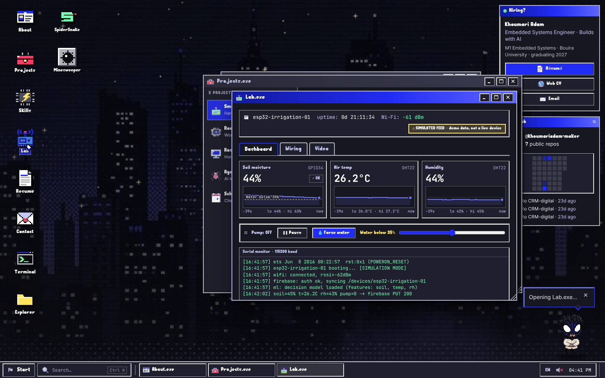
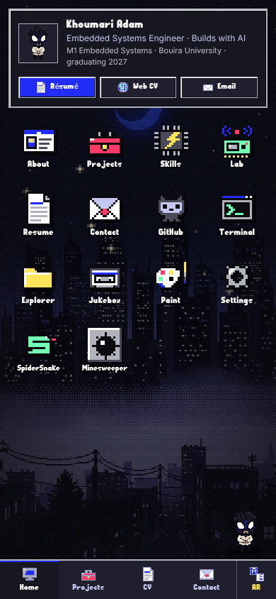
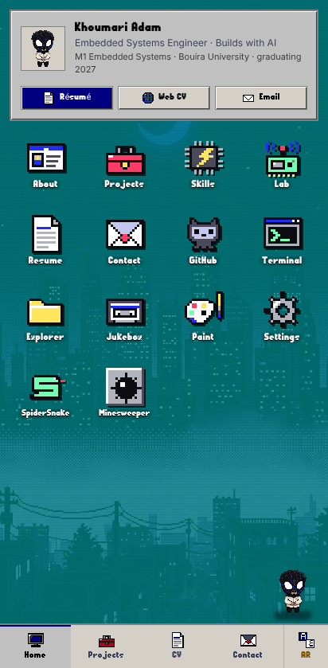

# Adam OS — Khoumari Adam's portfolio

A Windows 98-style desktop you can actually use: draggable windows, a Start menu, a terminal, games and a pixel-art spider who gives tips. It's the portfolio of **Khoumari Adam**, an embedded systems engineer (ESP32, robotics, Raspberry Pi AI home lab) from Bouira, Algeria. English and Arabic (right-to-left).



<p align="center"> </p>

**Recruiter?** Skip the fun and open the plain résumé at [`/resume`](src/app/resume/page.tsx) — it's linked from the boot screen, the desktop "Hiring?" card and the Start menu.

## What's inside

| App | What it does |
| --- | --- |
| About.exe | Bio, quick facts and an experience timeline |
| Projects.exe | Case studies: why, what I built, result, stack |
| Skills.exe | Skills mapped to where they were used (no made-up percentages) |
| Lab.exe | Simulated ESP32 irrigation dashboard: live sparklines, pump logic, wiring diagram, demo video slot |
| Resume.exe | CV download (EN/AR PDF) with a little spider animation |
| Contact.exe | Email, copy address, GitHub, and a message form that opens your own mail app |
| Terminal.exe | `help`, `neofetch`, `ls`/`cd`/`cat`, `open <app>`, `sudo hire-adam`, tab completion and history |
| GitHub.exe | Live public GitHub activity: repos, recent pushes and a 7-week heatmap (no backend) |
| Explorer, Paint, Jukebox, Settings | Classic accessories. Settings has the theme, wallpapers, living wallpaper, CRT bloom, screensaver and cursor |
| SpiderSnake, Minesweeper | Games, with best scores saved locally |

Desktop details: snap windows by dragging them to the screen edges, double-click a title bar to maximize, rubber-band select icons, right-click the desktop, use <kbd>Ctrl</kbd>+<kbd>K</kbd> to search everything, and <kbd>Esc</kbd> to close a window. Window positions, the wallpaper and settings are remembered between visits. Returning visitors skip the boot screen (add `?boot` to replay it).

Phones get a home screen with every app, full-screen app sheets and a bottom tab bar.

**Look and feel**
- Two themes: *Spider Night* (dark cobalt) and *Windows 98* (silver, navy and teal). Switch in Settings or with <kbd>Ctrl</kbd>+<kbd>K</kbd> → "theme".
- One hand-made pixel icon set (`src/lib/pixel-icons.ts`) used for the app icons and every UI glyph. Icons follow the theme colours.
- The Pixel Spider plays sprite animations (breathing, typing, waving, sleeping…) and sometimes drops onto the title bar of the window you're using.
- Windows grow out of their icon when opened and shrink into the taskbar when minimized.
- A BIOS screen, then an "Adam OS 98" splash on first visit.
- Living wallpapers: twinkling stars, fireflies and drifting clouds, drawn on a low-res canvas so they stay pixel-crisp.
- Arabic uses Reem Kufi for titles and IBM Plex Sans Arabic for text.
- Every animation respects the system "reduce motion" setting.

## Run it

```bash
npm install
npm run dev        # http://localhost:3000
npm run build      # static site in ./out
npm start          # serve ./out locally
npm run typecheck
npm run test:visual   # screenshot tests (run `npm run build` first)
```

The visual tests compare desktop and phone screenshots (dark, classic, Arabic, Projects, /resume) with the baselines in `tests/visual/__screenshots__/`, and check that phones never scroll sideways. After an intended visual change, update the baselines with `npm run test:visual -- --update-snapshots`. Baselines were made on Linux Chromium; other systems render fonts slightly differently.

## Deploy

It's a fully static export, so it needs no server.

- **GitHub Pages:** `.github/workflows/deploy.yml` builds and deploys on every push to `main`. One-time setup: *Settings → Pages → Source: GitHub Actions*. The workflow sets the `/adam-os` base path for you.
- **Vercel / Netlify:** import the repo. The build command is `npm run build` and the output directory is `out`.

Environment variables (both optional):

- `NEXT_PUBLIC_BASE_PATH`: set it when the site lives under a sub-path, e.g. `/adam-os`.
- `NEXT_PUBLIC_SITE_URL`: the public URL, used for social previews and the sitemap.

## Edit the content

| What | Where |
| --- | --- |
| Email, GitHub, LinkedIn, résumé files | `src/lib/profile.ts` (an empty field is hidden everywhere) |
| Projects (+ photos and links) | `src/lib/content/projects.ts`. Add photos to `public/projects/<id>.jpg` |
| Plain résumé page | `src/lib/content/resume.ts` |
| Interface text (EN/AR) | `src/lib/i18n/en.json`, `src/lib/i18n/ar.json` |
| Apps on the desktop / Start menu | `src/lib/apps.ts` |
| Lab demo video | drop a file at `public/lab/demo.mp4` |
| Icons | edit `src/lib/pixel-icons.ts`, then `python3 scripts/icons/render_icons.py --force` to refresh the desktop PNGs |
| Mascot animation frames | `python3 scripts/mascot/build_frames.py` (rebuilds `public/mascot/*-strip.png`) |
| Theme colours | CSS variables at the top of `src/app/globals.css` |

Any path to a file in `public/` must go through `asset()` from `src/lib/asset.ts`, so the site keeps working under a sub-path.

## Tech

Next.js 14 (app router, static export) · React 18 · TypeScript · Tailwind CSS · Framer Motion. Sounds are synthesized with the Web Audio API, so there are no audio files. There's no backend, no analytics and no cookies.

The project started from an AI agent pipeline. The original spec and agent workflows are in `adam-os-spec/` and `.agent/`.
